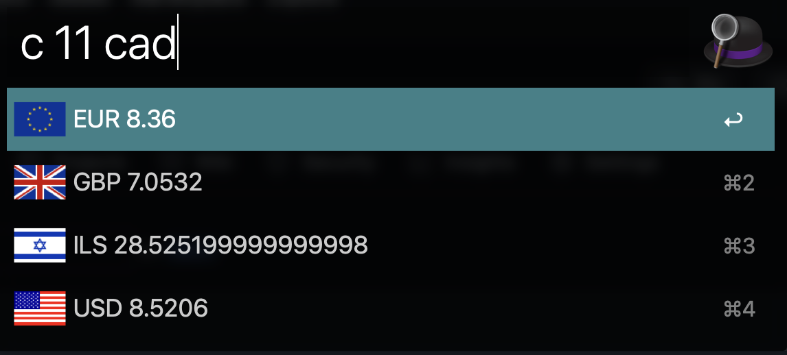

# Alfred Currency Convertor

Tested on Alfred 4

1. Import the workflow to Alfred
2. Go to <https://www.exchangerate-api.com/>, register and claim your api key
3. Open the workflow in finder
4. add the api key (row 6)

Now you can `c 11` and get the response from Alfred

>It will default to USD

> You can add any symbol you like and download the country symbol from <https://www.countryflagicons.com/FLAT/64/US.png>
